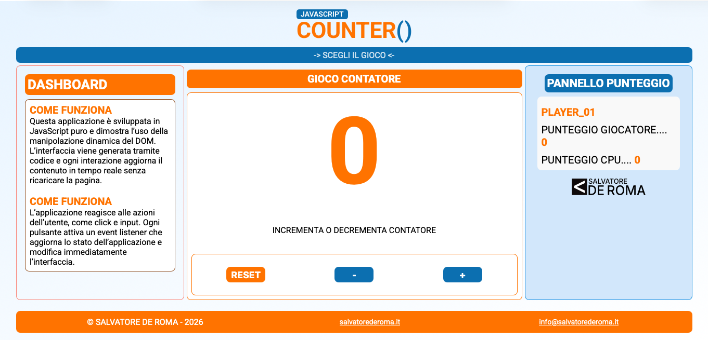

# JavaScript Counter + Pari/Dispari

<p align="center">
  
  
  
</p>

Applicazione front-end in JavaScript puro con due mini giochi:
- `Contatore`
- `Pari / Dispari`

L'interfaccia e i contenuti principali vengono aggiornati in tempo reale tramite manipolazione del DOM, senza ricaricare la pagina.

## Screenshot

<p align="center">
  
</p>

## Panoramica

Il progetto nasce dal brief didattico del contatore in JavaScript (`progetto.txt`) ed estende la consegna con:
- menu a tendina per scegliere il gioco
- pulsanti dinamici riutilizzati tra modalità diverse
- pannello punteggio con score utente e CPU
- layout responsive mobile/desktop con SCSS modulare

## Funzionalità

### 1) Modalità `CONTATORE`
- valore iniziale `0`
- pulsanti dinamici `+`, `-`, `RESET`
- decremento bloccato a `0` (no negativi)
- aggiornamento live del display principale

### 2) Modalità `PARI DISPARI`
- pulsanti dinamici `PARI`, `DISP`, `RESET`
- generazione numero casuale ad ogni click
- output `WIN` / `LOSE`
- aggiornamento punteggio giocatore e CPU
- reset completo dei punteggi di sessione

## Grafica attuale

La UI attuale usa un tema chiaro con accenti blu/arancione:
- sfondo con gradiente azzurro/bianco
- box principali con bordi arrotondati
- pulsanti blu con variante `reset` arancione
- animazione `lampeggiamento` su elementi chiave (menu/icona)
- font principale: `Roboto`

Variabili principali (`src/scss/abstract/_variables.scss`):

```scss
$coloreNero: #000;
$coloreBlu: #118ee2;
$coloreBluScuro: #0c6fb0;
$coloreArancione: #ff7300;
$coloreBackgroundElementi: #C6DEF5;
$fontFamilyMain: "Roboto", sans-serif;
$fontSize: 16px;
```

## Architettura pagina

`index.html` è organizzato in blocchi principali:
- `header`: logo + menu giochi
- `aside`: dashboard descrittiva (desktop)
- `main`: titolo gioco, display centrale, area pulsanti
- `sidebar`: pannello punteggio + branding
- `footer`: contatti e credits

Su desktop viene usata una griglia a 3 colonne (`aside`, `main`, `sidebar`), su mobile layout verticale.

## Logica JavaScript

### `src/js/main.js`
Gestisce il core applicativo:
- stato del contatore
- stato punteggi (`scoreUser`, `punteggioCPU`)
- setup iniziale dashboard (`PLAYER_01` e valori a `0`)
- render dei bottoni dinamici
- gestione click sulle voci menu (`CONTATORE`, `PARI DISPARI`)
- binding dinamico degli handler in base alla modalità selezionata

### `src/js/menu_action.js`
Gestisce apertura/chiusura del menu a tendina tramite toggle della classe:
- `menu__show`

## Struttura progetto (reale)

```text
.
├── index.html
├── README.md
├── progetto.txt
├── dist/
│   └── css/
│       ├── main.css
│       └── main.css.map
├── src/
│   ├── img/
│   │   ├── favicon/
│   │   ├── image_conter_app.svg
│   │   ├── image_even_odd_app.svg
│   │   ├── logo_deRoma_small.svg
│   │   ├── readme-preview.svg
│   │   └── ...
│   ├── js/
│   │   ├── main.js
│   │   └── menu_action.js
│   └── scss/
│       ├── main.scss
│       ├── abstract/
│       │   ├── _animations.scss
│       │   └── _variables.scss
│       ├── base/
│       │   └── _reset.scss
│       ├── components/
│       │   └── _button.scss
│       ├── layout/
│       │   ├── _footer.scss
│       │   └── _header.scss
│       └── pages/
│           └── _homePage.scss
└── img/
    ├── favicon/
    └── ...
```

## SCSS e compilazione CSS

Entry point SCSS:
- `src/scss/main.scss`

Output CSS usato dalla pagina:
- `dist/css/main.css`

Comandi utili dalla root del progetto:

```bash
# compilazione singola
sass src/scss/main.scss dist/css/main.css

# watch continuo
sass --watch src/scss/main.scss:dist/css/main.css

# alternativa senza installazione globale
npx sass --watch src/scss/main.scss:dist/css/main.css
```

## Avvio progetto

1. Apri `index.html` nel browser.
2. In parallelo, avvia il watch Sass se stai modificando gli stili.

Esempio:

```bash
npx sass --watch src/scss/main.scss:dist/css/main.css
```

## Requisiti coperti del brief

- JavaScript vanilla
- manipolazione DOM
- contatore con incremento/decremento/reset
- valore iniziale a `0`
- struttura ordinata tra HTML, JS, SCSS/CSS

## Miglioramenti già presenti

- multi-gioco tramite menu
- score panel con stato persistente durante la sessione
- UI responsive con separazione in partial SCSS
- branding personale e favicon completo

## Autore

**Salvatore De Roma**
- Sito: `salvatorederoma.it`
- Email: `info@salvatorederoma.it`
