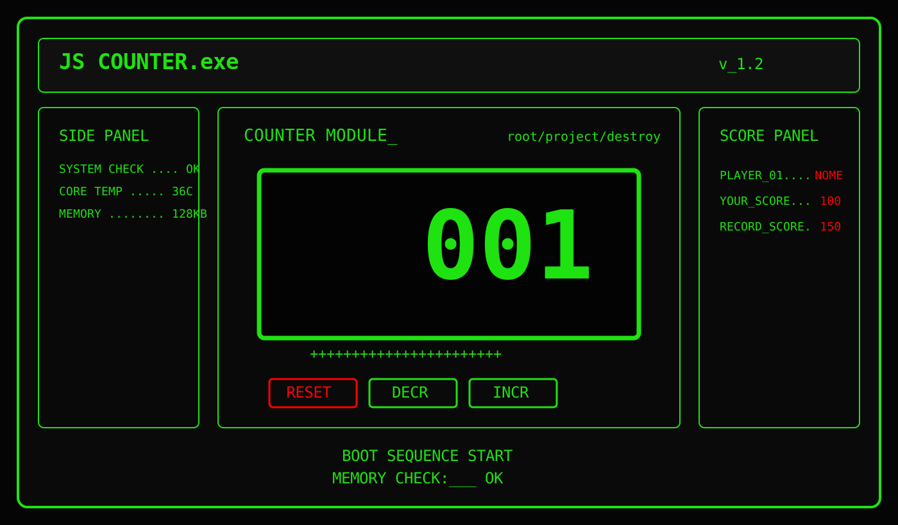

# JS COUNTER.exe

<p align="center">
  
  
  
</p>

<p align="center">
  Un progetto front-end in <strong>JavaScript puro</strong> che sviluppa un contatore con una forte identità visiva:
  monitor nero, verde fosforo, dettagli rossi, tipografia arcade e atmosfera da vecchio computer anni '80.
</p>

---

## Screenshot

<p align="center">
  
</p>

> Preview illustrativa del layout e dello stile del progetto in chiave CRT / rétro computer.

---

## Panoramica

Il progetto nasce da un brief semplice e chiaro: realizzare un'applicazione che simuli il comportamento di un counter.

Dal file `progetto.txt` emergono questi punti fondamentali:

- visualizzare il valore iniziale del counter impostato a `0`
- aumentare e diminuire il valore tramite pulsanti dedicati
- sviluppare tutto in `JavaScript vanilla`
- creare dinamicamente l'interfaccia del counter tramite manipolazione del DOM
- mantenere una struttura ordinata tra HTML, CSS/SCSS e JavaScript

Oltre alla logica base, il progetto porta il concept in una direzione estetica precisa: un piccolo software rétro con look da terminale e dashboard arcade.

---

## Obiettivi

- costruire un counter interattivo
- gestire eventi `click` sui controlli
- aggiornare il valore mostrato a schermo
- impedire che il contatore scenda sotto zero
- definire un'identità grafica riconoscibile
- organizzare lo stile con SCSS modularizzato

---

## Stack

```txt
HTML5
SCSS
CSS3
JavaScript Vanilla
Google Fonts
- Press Start 2P
- Share Tech Mono
```

---

## Stile del progetto

L'interfaccia è pensata come se fosse il pannello di un vecchio computer:

- sfondo nero `#000000`
- verde fosforo `#1FE211`
- rosso acceso `#FF0004`
- font principale `Press Start 2P`
- font secondario `Share Tech Mono`
- effetti di lampeggiamento
- box con bordi neon e impaginazione da terminale

Snippet delle variabili:

```scss
$coloreNero: #000;
$coloreVerde: #1FE211;
$coloreVerdeScuro: #17b70b;
$coloreRosso: #FF0004;
$fontFamilyMain: "Press Start 2P", system-ui;
$fontFamilyText: "Share Tech Mono", monospace;
```

---

## Struttura del progetto

```bash
.
├── index.html
├── README.md
├── progetto.txt
├── css
│   ├── main.css
│   ├── main.css.map
│   ├── main.scss
│   ├── abstract
│   │   └── _variables.scss
│   └── section
│       ├── _button.scss
│       └── _homePage.scss
├── js
│   ├── contatore.js
│   └── menuResponsive.js
└── img
    └── readme-preview.svg
```

---

## Avvio del progetto

Puoi aprire direttamente `index.html` nel browser.

Se preferisci un server locale:

```bash
npx serve
```

In alternativa puoi usare `Live Server` da VS Code.

---

## Struttura dell'interfaccia

La pagina è organizzata come una mini dashboard software:

- `header` con titolo, versione e menu
- `aside` laterale
- `main` con il modulo counter
- `sidebar` con score panel
- `footer` finale

Snippet HTML:

```html
<header id="header" class="grid-item">
  <h1>JS COUNTER.exe</h1>
  <span>v_1.2</span>
  <nav id="nav-bar">
    <span class="icon-menu">MENU</span>
    <ul class="menu-lista menu-show">
      <li><a href="">conatatore</a></li>
      <li><a href="">cronometro</a></li>
      <li><a href="">pari dispari</a></li>
    </ul>
  </nav>
</header>
```

Snippet del modulo centrale:

```html
<div class="box-contatore">
  <div id="numero">001</div>
  <span>+++++++++++++++++++++++</span>
  <div class="box-button">
    <button class="btn reset">RESET</button>
    <button class="btn">DECR</button>
    <button class="btn">INCR</button>
  </div>
</div>
```

---

## Logica del counter

La logica del contatore è contenuta nel file `js/contatore.js`.
L'idea implementativa segue il brief originale:

1. inizializzare il valore del counter
2. selezionare i nodi del DOM
3. creare i pulsanti dinamicamente
4. aggiornare il numero sul display
5. collegare le funzioni di incremento, decremento e reset

### Inizializzazione

```js
document.addEventListener("DOMContentLoaded", () => {
    let counter = 0;

    const tagContatore = document.querySelector(".contatore");
    const boxButton = document.querySelector(".box-button");

    const btnIncrease = document.createElement("button");
    const btnDecrease = document.createElement("button");
    const btnReset = document.createElement("button");
});
```

### Creazione dei controlli

```js
btnReset.textContent = "RESET";
btnReset.className = "btn reset";

btnDecrease.textContent = "-";
btnDecrease.className = "btn";

btnIncrease.textContent = "+";
btnIncrease.className = "btn";
```

### Aggiornamento del display

```js
tagContatore.textContent = counter;

boxButton.appendChild(btnReset);
boxButton.appendChild(btnDecrease);
boxButton.appendChild(btnIncrease);
```

### Incremento e decremento

```js
function incremento () {
    counter++;
    tagContatore.textContent = counter;
}

function decremento() {
    counter--;
    tagContatore.textContent = counter;

    if (counter <= 0) {
        counter = 0;
        tagContatore.textContent = counter;
    }
}
```

### Reset

```js
function reset() {
    counter = 0;
    tagContatore.textContent = counter;
}
```

### Event listeners

```js
btnIncrease.addEventListener("click", incremento);
btnDecrease.addEventListener("click", decremento);
btnReset.addEventListener("click", reset);
```

### Logica funzionale in breve

```txt
START  -> 0
INCR   -> +1
DECR   -> -1
MIN    -> 0
RESET  -> 0
```

---

## Menu responsive

Nel progetto è presente anche un piccolo script per gestire il menu mobile.
Il file `js/menuResponsive.js` mostra o nasconde la lista al click su `MENU`.

Snippet:

```js
const menuBtn = document.querySelector(".icon-menu");
let listaUl = document.querySelector(".menu-lista");

menuBtn.addEventListener("click", () => {
    if (listaUl.classList.contains("menu-show")) {
        listaUl.classList.remove("menu-show");
    } else {
        listaUl.classList.add("menu-show");
    }
});
```

La classe `menu-show` viene usata come stato per controllare la visibilità del blocco navigazione.

---

## Struttura SCSS

Il CSS è organizzato in più livelli:

- `_variables.scss` per colori e font
- `_homePage.scss` per layout e sezioni principali
- `_button.scss` per lo stile dei pulsanti
- `main.scss` per importazioni globali, reset e media query

Snippet dei pulsanti:

```scss
.btn {
    display: flex;
    align-items: center;
    justify-content: center;
    width: 75px;
    height: 30px;
    border: 2px solid variables.$coloreVerde;
    background-color: variables.$coloreNero;
    color: white;
    font-size: 18px;
    box-shadow: 0 0 5px 2px variables.$coloreVerde;
}

.reset {
    border: 2px solid variables.$coloreRosso;
    box-shadow: 0 0 5px 2px variables.$coloreRosso;
}
```

Snippet layout responsive:

```scss
@media (min-width:768px) {
    #container-grid {
        margin: 0 auto;
        max-width: 1000px;
        display: grid;
        grid-template-columns: 1fr 2fr 1fr;
        grid-template-areas:
            "header header header"
            "aside main sidebar"
            "footer footer footer";
    }
}
```

---

## Requisiti del brief

Riprendendo `progetto.txt`, il progetto punta a soddisfare questi criteri:

- corretto funzionamento dei pulsanti di incremento e decremento
- visualizzazione del valore del counter
- uso di JavaScript puro senza framework
- manipolazione del DOM
- buona organizzazione del codice
- corretta struttura del repository con `README.md`

Font indicati nel brief:

```txt
Press Start 2P -> titoli
VT323          -> numeri
Share Tech Mono -> testi secondari
```

---

## Stato attuale

Il repository mostra chiaramente la direzione del progetto, ma ci sono ancora alcuni punti da rifinire per allineare completamente interfaccia e logica:

- `index.html` carica al momento `menuResponsive.js`
- `contatore.js` è presente nel progetto ma non è incluso nella pagina attuale
- nel file JavaScript del counter viene cercato `.contatore`, mentre nell'HTML attuale il display mostrato è `#numero`
- il layout e il concept grafico sono già ben definiti, mentre la parte finale di integrazione logica è ancora da consolidare

Questo README documenta sia il brief sia la logica prevista e già scritta nel repository.

---

## Possibili miglioramenti

- collegare il file `contatore.js` alla pagina attuale
- unificare i selettori tra HTML e JavaScript
- aggiungere `localStorage` per salvare il valore
- rendere dinamici score e record
- introdurre una vera sezione cronometro
- usare `VT323` per il display numerico
- aggiungere un effetto scanline CRT

---

## Autore

**Salvatore De Roma**  
Progetto realizzato come esercitazione JavaScript.

<p align="center">
  <strong>SYSTEM READY :: INSERT COIN</strong>
</p>
